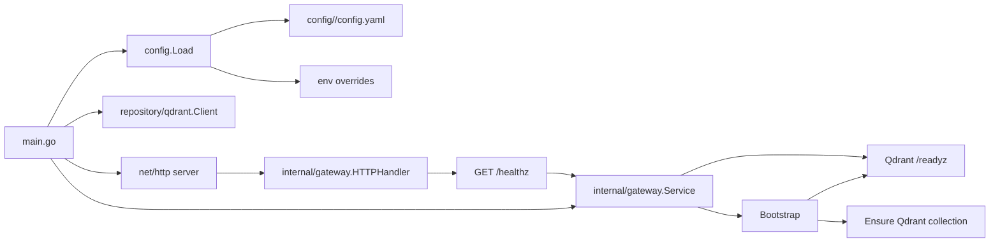
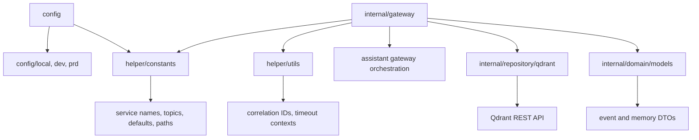
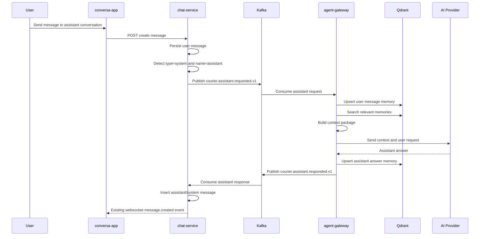
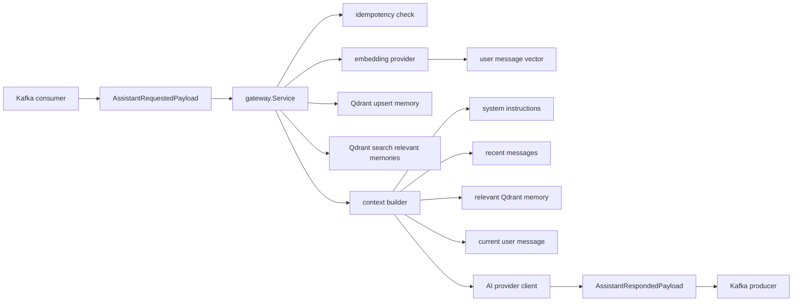
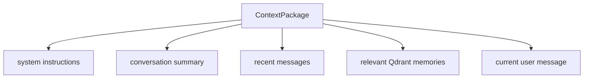

# Agent Gateway Codegraph

This document explains how requests and future assistant events flow through `agent-gateway`.

## Current Runtime Flow

The current implementation is a service skeleton that starts an HTTP server, checks Qdrant readiness, and ensures the memory collection exists.

## Package Responsibilities

## Target Assistant Event Flow

This is the agreed feature flow once Kafka and OpenAI provider integration are added.

## Target Internal Layer Flow

When the assistant request consumer is implemented, the internal flow should look like this:

## Context Package Shape

`agent-gateway` should avoid sending the entire conversation history to the AI provider. It should send a compact context package:

The current DTO lives in `internal/domain/models.ContextPackage`.

## Ownership Boundaries

- `chat-service` owns canonical chat message storage and websocket fanout.
- `agent-gateway` owns assistant context preparation, vector memory, provider calls, and assistant response events.
- Qdrant stores AI memory vectors and metadata, not canonical chat messages.
- Kafka is the boundary between `chat-service` and `agent-gateway`.

— Nội dung được viết/cập nhật bởi AI (OpenAI Codex).
