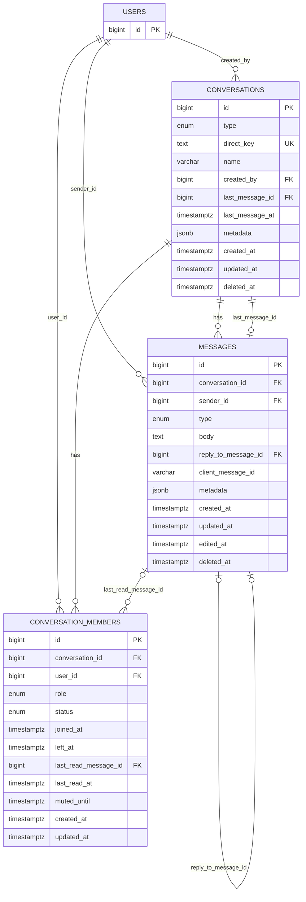

# Chat Service V1 Ticket

## Ticket

**Title:** Build database foundation for user-to-user and group text messaging

**Type:** Epic / Foundation

**Service:** `chat-service`

**Summary:**

Create the initial database schema for a new `chat-service` so users can send text messages in direct conversations and group conversations. The schema must be compatible with the existing `user-service`, where `"user-service".users` remains the source of truth for user identities.

## Business Goal

Enable the platform to support:

- 1-to-1 text messaging between two users
- Group text messaging among multiple users
- Basic inbox and unread tracking for future API and realtime delivery work

## Scope

Included in V1:

- Database schema for conversations
- Database schema for conversation members
- Database schema for text messages
- Referential integrity with `"user-service".users`
- Constraints and triggers for core data consistency

Excluded from this ticket:

- WebSocket or realtime delivery
- Push notifications
- Media or file attachments
- Message reactions
- Message search
- End-to-end encryption

## User Stories

### Story 1: Create Direct Conversation

As a user, I want to start a direct conversation with another user so that I can exchange private text messages.

**Acceptance Criteria**

- A direct conversation is created for exactly two users.
- If a direct conversation already exists for the same pair of users, the existing conversation is reused.
- A user cannot create a direct conversation with themselves.
- The database prevents more than two active members in a direct conversation.

### Story 2: Create Group Conversation

As a user, I want to create a group conversation so that multiple users can chat in the same room.

**Acceptance Criteria**

- A group conversation must have a non-empty name.
- The creator becomes the `owner`.
- Each member appears only once in the same conversation.
- Member status is tracked as `active`, `left`, or `removed`.

### Story 3: Send Text Message

As a user, I want to send a text message in a conversation so that other members can read it.

**Acceptance Criteria**

- Only active members can send messages.
- Message body cannot be empty.
- Each new message updates the conversation's last message metadata.
- Duplicate retries can be prevented with `client_message_id`.

### Story 4: View Inbox

As a user, I want to view my conversation list so that I can see my latest chats.

**Acceptance Criteria**

- Conversations can be sorted by `last_message_at` descending.
- Only conversations where the user is an active member are returned.
- The schema supports retrieving the latest message and read state.

### Story 5: Mark Messages as Read

As a user, I want to mark messages as read so that unread tracking is accurate.

**Acceptance Criteria**

- Read state is tracked per member.
- `last_read_message_id` must belong to the same conversation.
- The schema supports unread count calculation in future application logic.

## Technical Steps

1. Create a dedicated PostgreSQL schema named `"chat-service"`.
2. Create enum types for:
   - conversation type
   - member role
   - member status
   - message type
3. Create the `conversations` table.
4. Create the `conversation_members` table.
5. Create the `messages` table.
6. Add foreign keys from chat tables to `"user-service".users(id)`.
7. Add indexes for:
   - direct conversation uniqueness
   - inbox sorting
   - member lookup
   - message pagination
   - message idempotency
8. Add triggers to enforce:
   - direct conversation member limit
   - sender must be an active member
   - `last_read_message_id` must belong to the same conversation
   - `reply_to_message_id` must belong to the same conversation
   - conversation last message metadata stays in sync
9. Prepare follow-up implementation tasks for repository, use case, API, and events.

## Deliverables

- Migration up script:
  [001_create_chat_core_tables.up.sql](/Users/francis.vu/workspace/repository-golang/courier/chat-service/migrations/001_create_chat_core_tables.up.sql:1)
- Migration down script:
  [001_create_chat_core_tables.down.sql](/Users/francis.vu/workspace/repository-golang/courier/chat-service/migrations/001_create_chat_core_tables.down.sql:1)
- Planning/ticket document:
  [chat-messaging-ticket-en.md](/Users/francis.vu/workspace/repository-golang/courier/chat-service/docs/chat-messaging-ticket-en.md:1)

## Table Schema Diagram

## Notes

- `direct_key` should be generated from the two user IDs in canonical order, for example: `smallerUserID:largerUserID`.
- IDs should follow the existing Snowflake-style `BIGINT` pattern already used in `user-service`.
- `chat-service` should keep only messaging data and should not duplicate the full user profile.
- Realtime delivery can be added later using polling first, then outbox events plus WebSocket/Kafka/NATS.

## Suggested Follow-up Tickets

1. Scaffold `chat-service` application structure based on `user-service`.
2. Implement `CreateDirectConversation` use case.
3. Implement `CreateGroupConversation` use case.
4. Implement `SendTextMessage` use case.
5. Implement inbox and message listing APIs.
6. Implement mark-as-read flow.
7. Publish outbox events for chat domain changes.
