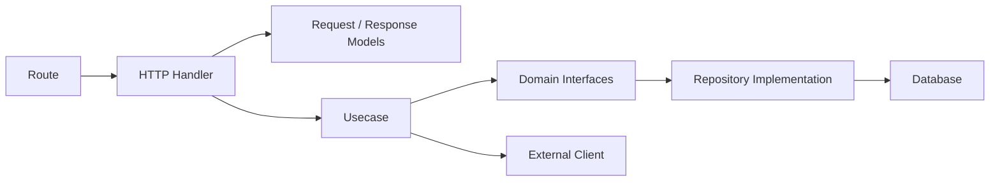
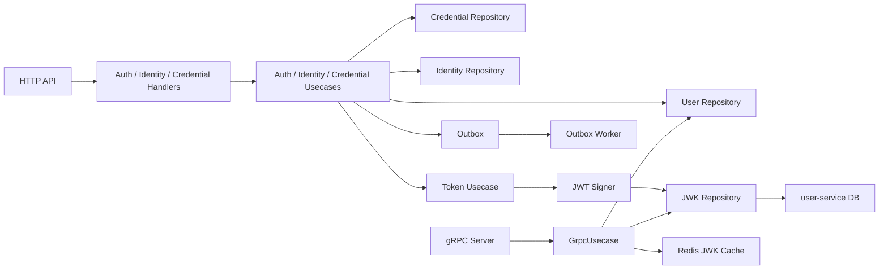
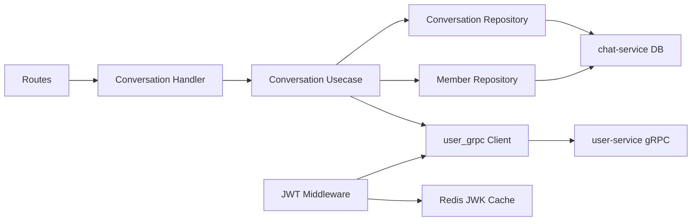
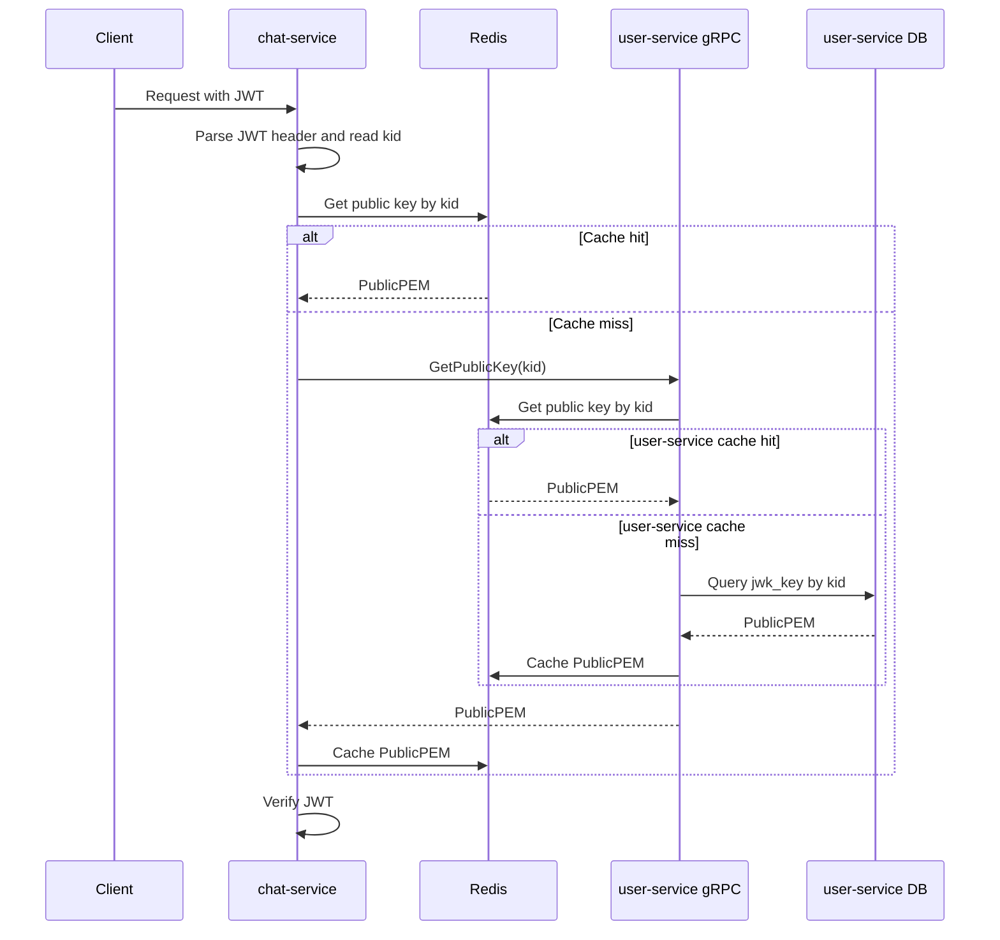
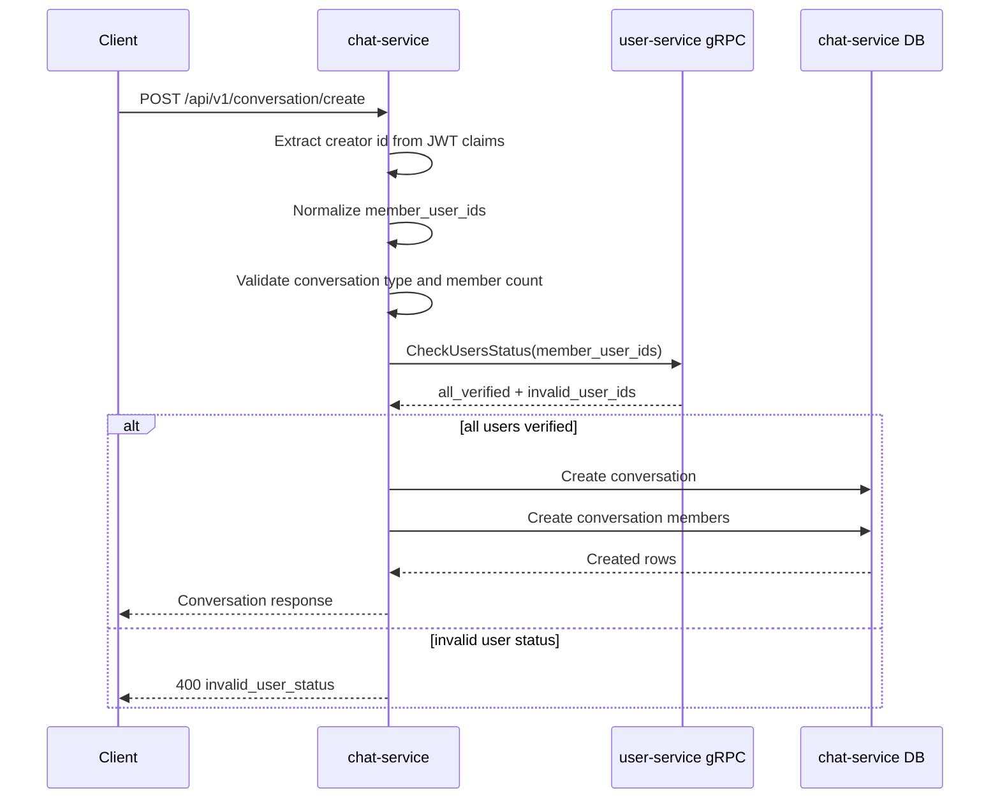
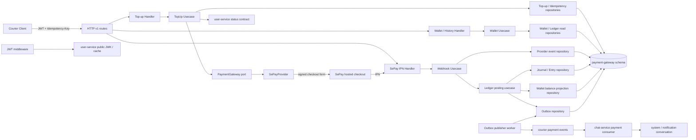

# Codegraph

This document gives a lightweight map of how code flows through courier services.

## Service Layer Pattern

Most services follow this shape:



## user-service



Important files:

- `user-service/internal/api/http/v1/`
- `user-service/internal/usecase/`
- `user-service/internal/repository/`
- `user-service/internal/api/grpc/grpc_server.go`
- `user-service/internal/api/grpc/grpc_usecase.go`

## chat-service



Important files:

- `chat-service/internal/api/http/v1/conversation_handler.go`
- `chat-service/internal/usecase/conversation/conversation_uc.go`
- `chat-service/internal/repository/persistent/`
- `chat-service/internal/repository/external/user_grpc/client.go`
- `chat-service/internal/api/http/middleware/auth_middleware.go`

## JWT Public Key Verification Flow



## Create Conversation Flow



## Cross-Service Contract Rule

If code crosses service boundaries, start from `docs/grpc-contracts.md` and `shared/grpc/`. Avoid direct database access across service ownership boundaries.

## payment-gateway (planned)

`payment-gateway` will own payment attempts, wallet accounting and the
immutable ledger. It will not read another service database: `user-service`
remains the authority for identity and user eligibility; `chat-service` owns
delivery of notification messages.



### Top-up and credit flow

```mermaid
sequenceDiagram
    participant C as Client
    participant PG as payment-gateway
    participant DB as payment-gateway DB
    participant S as SePay Gateway
    participant E as Event Bus
    participant CS as chat-service

    C->>PG: POST /wallet/top-ups + Idempotency-Key
    PG->>PG: validate JWT, eligible user, limits and VND
    PG->>DB: create pending topup_intent + idempotency record
    PG->>PG: generate unique provider_invoice_number and SePay signature
    PG-->>C: checkout action + signed fields + expiry
    C->>S: POST checkout form
    S-->>C: redirect result (display only)
    S->>PG: POST /webhooks/sepay (IPN)
    PG->>PG: authenticate IPN and validate amount/status/invoice
    PG->>DB: lock intent + balance; persist provider event/transaction
    PG->>DB: post balanced journal + update projection + insert outbox
    PG-->>S: HTTP 200
    PG->>E: publish payment.wallet_credited.v1
    E->>CS: consume event idempotently
    CS->>CS: create system message in notification conversation
```

### Database ownership map

| Aggregate | Tables | Write owner | Notes |
| --- | --- | --- | --- |
| Wallet | `wallets`, `wallet_balances` | Wallet/Ledger usecases | Balance is a locked, rebuildable projection. |
| Accounting | `ledger_accounts`, `ledger_journals`, `ledger_entries` | Ledger posting usecase only | Journal/entries are immutable and balanced. |
| Payment attempt | `topup_intents`, `idempotency_keys` | TopUp usecase | One provider invoice per intent; client replay is safe. |
| Provider evidence | `provider_events`, `provider_transactions` | Webhook/Reconciliation usecases | Deduplicate before ledger posting. |
| Integration | `outbox_events` | Same DB transaction as ledger posting | Ensures eventual notification event publication. |
| Operations | `reconciliation_runs`, `reconciliation_items`, `audit_logs` | Workers/admin operations | Never changes accounting entries directly. |

### Planned primary paths

| Concern | Primary path |
| --- | --- |
| HTTP API | `payment-gateway/internal/api/http/v1/` |
| JWT and request safeguards | `payment-gateway/internal/api/http/middleware/` |
| Top-up, wallet and ledger rules | `payment-gateway/internal/usecase/{topup,wallet,ledger,webhook}/` |
| Provider port and normalized types | `payment-gateway/internal/domain/interfaces/payment_gateway.go` |
| SePay adapter | `payment-gateway/internal/repository/external/sepay/` |
| PostgreSQL persistence | `payment-gateway/internal/repository/persistent/` |
| Event publication/reconciliation/expiry | `payment-gateway/internal/worker/` |
| Shared cross-service contracts | `shared/grpc/` and `event-bus/contracts/` |
