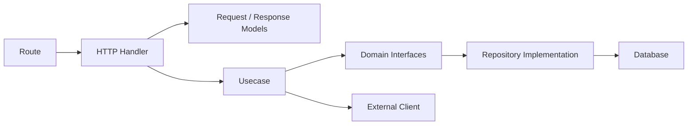
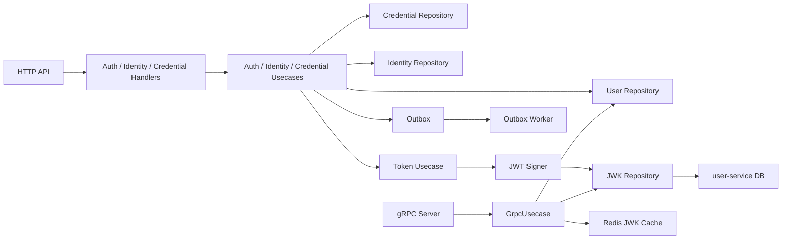
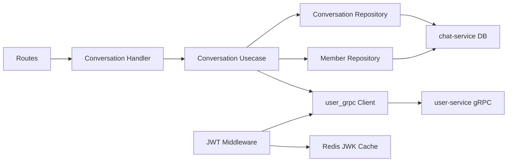
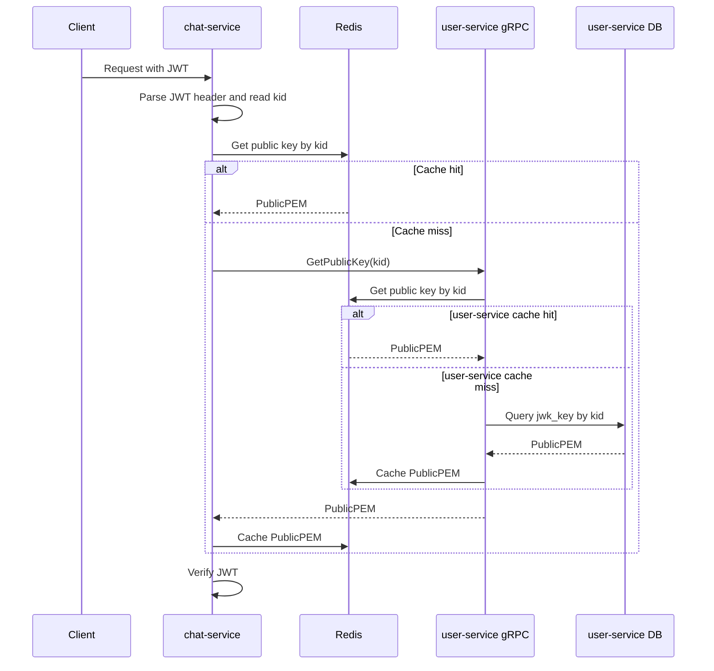
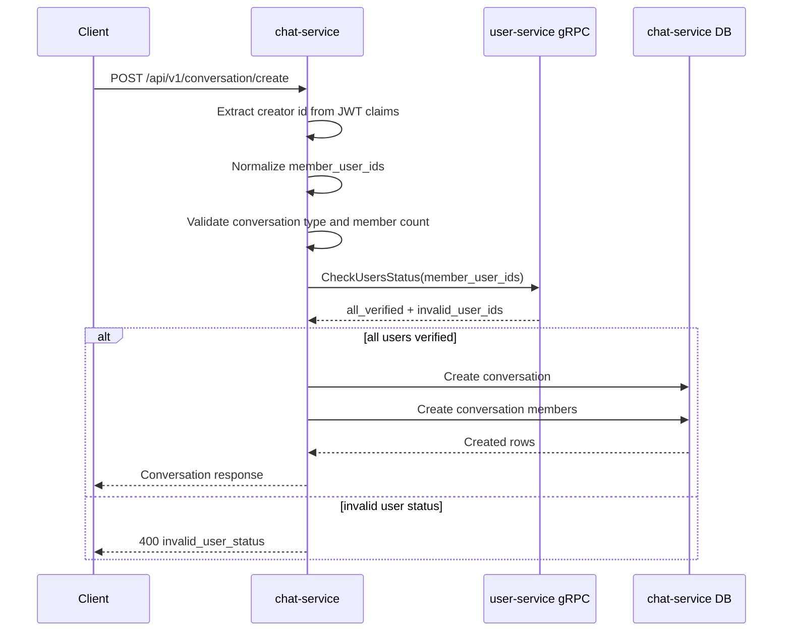

# Codegraph

This document gives a lightweight map of how code flows through courier services.

## Service Layer Pattern

Most services follow this shape:

## user-service

Important files:

- `user-service/internal/api/http/v1/`
- `user-service/internal/usecase/`
- `user-service/internal/repository/`
- `user-service/internal/api/grpc/grpc_server.go`
- `user-service/internal/api/grpc/grpc_usecase.go`

## chat-service

Important files:

- `chat-service/internal/api/http/v1/conversation_handler.go`
- `chat-service/internal/usecase/conversation/conversation_uc.go`
- `chat-service/internal/repository/persistent/`
- `chat-service/internal/repository/external/user_grpc/client.go`
- `chat-service/internal/api/http/middleware/auth_middleware.go`

## JWT Public Key Verification Flow

## Create Conversation Flow

## Cross-Service Contract Rule

If code crosses service boundaries, start from `docs/grpc-contracts.md` and `shared/grpc/`. Avoid direct database access across service ownership boundaries.
