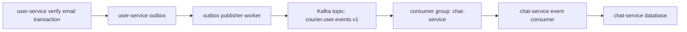

# Add event-driven system conversations for verified users

## Problem statement

`chat-service` needs default system conversations for every verified user in the messaging app. Each user should have two special conversations with `type = system`:

- `notification`: backend-generated notifications delivered as messages.
- `assistant`: a future AI assistant conversation for user support.

When a user verifies email successfully in `user-service` (`users.status = verified`), the system should automatically provision these conversations in `chat-service`. Existing verified users should be backfilled with empty system conversations.

## Agreed decisions

- Use `user_id` as `conversations.created_by` for system conversations.
- Backfill existing verified users with empty `notification` and `assistant` conversations only; do not create historical notification messages for old users.
- Use approach A for backend/system messages: remove direct FK constraint `fk_messages_sender`; validate by trigger so `sender_id > 0` must reference an existing user, and `sender_id = 0` is allowed only for `type = system` conversations.
- Create a top-level `event-bus/` folder for Kafka configuration, event contracts, routing conventions, and local infrastructure documentation. Service-specific publish/consume business logic stays in each service.

## RabbitMQ vs Kafka comparison

### RabbitMQ

Pros:
- Lightweight to run locally and in early production phases.
- Strong fit for service integration workflows, command-like events, routing keys, retries, delayed/dead-letter queues, and consumer acknowledgements.
- Easier operational model for the current Courier phase.
- Natural match for `user.email_verified -> chat-service provisioning` where each event triggers work in one or more services.

Cons:
- Not designed as a long-retention immutable event log.
- Replay and large-scale stream processing are weaker than Kafka.
- Ordering guarantees are typically queue-scoped and can become more complex with competing consumers.

### Kafka

Pros:
- Excellent durable event log with long retention and replay.
- Better for high-volume streams, analytics, audit pipelines, fan-out at scale, and event-sourced consumers.
- Strong partition-based ordering model.

Cons:
- Heavier local and production operations.
- More infrastructure complexity for this phase.
- Retry/DLQ workflow semantics require additional patterns and conventions.
- For current transactional integration events, Kafka is more than needed.

### Recommendation for this phase

Use Kafka as the main event-driven target. Keep the event envelope broker-neutral enough that other broker adapters can be added later if Courier needs workflow-oriented messaging.

## Proposed architecture



Event envelope example:

```json
{
  "event_id": "snowflake-or-uuid",
  "event_type": "user.email_verified",
  "event_version": 1,
  "occurred_at": "2026-07-31T00:00:00Z",
  "source": "user-service",
  "aggregate_type": "user",
  "aggregate_id": "123",
  "payload": {
    "user_id": 123,
    "email": "user@example.com",
    "status": "verified"
  }
}
```

## Implementation steps

1. Create branch `issue/24-5/event-driven-chat` from `main`.
2. Add `event-bus/` documentation and Kafka local definitions:
   - main topic: `courier.user.events.v1`
   - event type: `user.email_verified.v1`
   - consumer group: `chat-service`
   - retry and DLQ topic convention
   - broker-neutral event envelope docs
3. Update `chat-service` migrations:
   - add `system` to `conversation_type_enum`
   - add unique partial index for one system conversation per `(created_by, name)`
   - add `processed_events` table for idempotent consumers
   - remove `fk_messages_sender`
   - update trigger validation for `sender_id = 0` only in system conversations and `sender_id > 0` only when user exists and is active conversation member
   - backfill `notification` and `assistant` conversations for existing verified users
4. Update `chat-service` domain/usecase/repositories:
   - add constants/models for system conversation names
   - add idempotent `EnsureSystemConversations(ctx, userID)` flow
   - add backend/system message creation path for notification messages with `sender_id = 0`
5. Add `chat-service` event consumer:
   - consume `user.email_verified.v1`
   - insert into `processed_events` transactionally
   - ensure system conversations
   - create the new email verification notification message only for new events
6. Update `user-service` outbox flow:
   - create `user.email_verified.v1` outbox event in the same transaction that marks the user as verified
   - add Kafka publisher adapter for integration events
   - keep email sending behavior intact
7. Wire configuration:
   - add Kafka config for local/dev with Kafka UI at `http://localhost:8081`
   - wire publisher in `user-service`
   - wire consumer startup in `chat-service`
8. Tests and validation:
   - migration syntax review
   - unit tests for system conversation provisioning idempotency
   - unit tests for message validation behavior where practical
   - `make test` in affected services

## Completion criteria

- New email verification emits `user.email_verified.v1` through the outbox publisher.
- `chat-service` provisions `notification` and `assistant` system conversations exactly once per verified user.
- Existing verified users are backfilled with empty system conversations.
- Backend messages can use `sender_id = 0` only in system conversations.
- Normal user messages still require active conversation membership.
- Event consumer is idempotent and safe to retry.

— Nội dung được viết/cập nhật bởi AI (OpenAI Codex).
