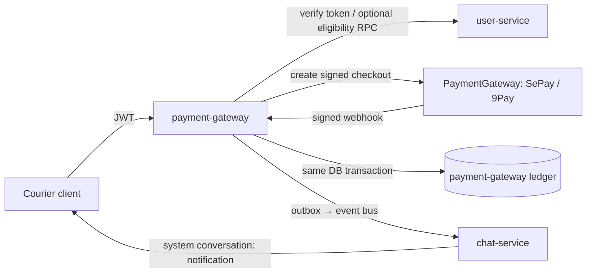
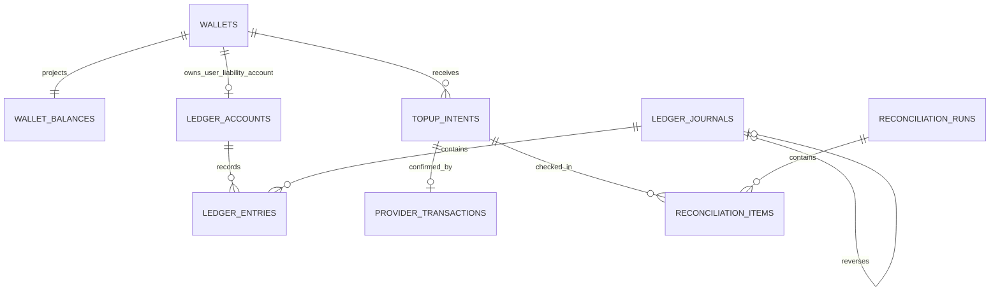

# Payment Gateway — Foundation Design

**Status:** SePay selected; architecture and data model approved for implementation. No runtime service or migration is created by this document yet.

## 1. Scope and essential decision

`payment-gateway` is the bounded context that owns Courier's **internal value
ledger**: wallet balances, top-ups, payment attempts, transaction history and
reconciliation. It does not own identity, KYC or authentication. Those remain
in `user-service`; the only identity reference kept here is `user_id`.

The initial product scope is deliberately narrow:

| In scope now | Explicitly deferred |
| --- | --- |
| One VND wallet per eligible Courier user | Withdrawal / payout |
| Create and pay a top-up request | P2P transfer |
| SePay-backed VietQR / domestic-bank QR top-up | Multiple currency balances and FX |
| Provider webhook, verification, reconciliation | Linking or storing bank-card credentials |
| Balance and immutable transaction history | KYC implementation |
| Notification through chat-service's `system/notification` conversation | Merchant payment |

### Important regulatory boundary

Calling this an “e-wallet” and allowing users to hold or transfer funds is a
regulated activity in Vietnam. Current SBV rules require an intermediary-payment
license for e-wallet services, a payment-guarantee account and operational,
security and reporting obligations. A payment provider's API credentials do
**not** transfer that permission to Courier. Before any production launch,
Counsel/compliance must choose one of these models:

1. **Closed-loop Courier credit (recommended MVP):** money can only pay for
   Courier's own goods/services; no cash-out and no P2P. Contractually confirm
   this model with the acquiring provider and counsel.
2. **Licensed/partner-wallet model:** a licensed Vietnamese intermediary-payment
   institution is the wallet issuer/custodian; Courier integrates as its
   platform.
3. **Courier as wallet issuer:** obtain the required licences, partner-bank
   arrangements, safeguarding, AML/KYC, risk and reporting operations first.

This document designs the accounting core so that it works with (1) now and
does not block (2) or (3) later. It is not legal advice.

Useful primary/provider references: [Decree 52/2024](https://thuvienphapluat.vn/van-ban/EN/Tien-te-Ngan-hang/Decree-52-2024-ND-CP-regulations-on-cashless-payments/613117), [Circular 40/2024](https://thuvienphapluat.vn/van-ban/EN/Tien-te-Ngan-hang/Circular-40-2024-TT-NHNN-on-provision-of-payment-intermediary-services/621475), [SePay Webhooks](https://developer.sepay.vn/en/sepay-webhooks).

## 2. Provider strategy — SePay first

The first adapter is **SePayProvider**, using SePay's **Payment Gateway**
product—not only its Banking API/Webhooks product. The gateway has a separate
sandbox, hosted checkout, signed form creation, IPN and redirect callbacks. Its
documented payment methods are bank-transfer QR (`BANK_TRANSFER`), NAPAS QR
(`NAPAS_BANK_TRANSFER`) and international card (`CARD`: Visa/Mastercard/JCB).
The provider abstraction must still accommodate both hosted checkout and a
direct bank-collection integration, because SePay's Banking API can be a useful
future alternative for VietQR-only collection.

Do not couple the ledger to a SePay payload, a bank or a QR generator. Each
provider has distinct merchant onboarding, signing, settlement and dispute
semantics; hide those behind a narrow port so an additional provider does not
change accounting code.

| Phase | Candidate | Why / limitation | Decision |
| --- | --- | --- | --- |
| MVP | **SePayProvider** | Hosted SePay checkout, sandbox, QR/NAPAS QR/card methods, redirect and IPN. | Implement first. |
| Domestic / international checkout | **NinePayProvider** (9Pay) | A future hosted-gateway adapter; treat its redirect/IPN and commercial onboarding as separate from SePay. | Discovery and contract verification before enabling. |
| Domestic breadth fallback | **VNPAYProvider** | QR, domestic-bank and international-card options with IPN. | Add when product/commercial need is confirmed. |
| Wallet-native | **MoMoProvider**, **ZaloPayProvider** | QR/gateway and signed server callbacks, each with its own merchant onboarding. | Add only when demand justifies it. |
| Stripe | Not a default answer here: Stripe's own policy lists digital wallets and P2P money transmission as restricted/prohibited in many cases. | Do not use for Courier stored value without written approval. |

For the first release, activate SePay Payment Gateway **Sandbox** from
`my.sepay.vn`, keep its sandbox `MERCHANT ID` and `SECRET KEY` separate from
production credentials, and configure a public HTTPS IPN endpoint. SePay
requires a successful IPN acknowledgement to return HTTP 200. The hosted
checkout form is signed server-side with HMAC-SHA256; never expose the secret to
the client. [Sandbox](https://developer.sepay.vn/vi/cong-thanh-toan/sandbox),
[checkout form](https://developer.sepay.vn/vi/cong-thanh-toan/API/don-hang/form-thanh-toan),
[IPN](https://developer.sepay.vn/vi/cong-thanh-toan/IPN).

### Provider acceptance criteria

Before signing, obtain written answers for: permitted business model (closed-loop
credit versus wallet); eligible user residency/KYC; VietQR bank and wallet
coverage; international-card countries/currencies; fees/taxes/minimums;
settlement timing and reserve; refund/chargeback/dispute flow; sandbox; webhook
retry and signing; status-query API; reconciliation report; PCI scope; rate
limits/SLAs; data residency; and production-support escalation.

## 3. Service architecture

Use the same Go/Gin/Wire shape as `user-service` and `chat-service`; keep the
payment-specific boundary at the provider adapter and ledger usecase.

```text
payment-gateway/
├── main.go
├── Makefile, Dockerfile, docker-compose.yaml
├── config/<env>/config.yaml
├── database/{gorm.go,sqlx.go}
├── migrations/                     # service-owned migrations after approved
├── startup/
├── helper/{constants,dispatcher,error_handler,healthcheck,http_common,transaction,utils}/
├── internal/
│   ├── api/http/{middleware,v1}/    # wallet + top-up APIs, provider webhook routes
│   ├── api/grpc/                    # only if another service truly needs sync balance access
│   ├── domain/{entities,models,interfaces}/
│   ├── usecase/{wallet,topup,ledger,reconciliation,webhook}/
│   ├── repository/persistent/{wallet,ledger,topup,outbox}/
│   ├── repository/external/{payment_provider,sepay,kafka,user_grpc,redis}/
│   ├── worker/{outbox_publisher,reconciliation,topup_expiry}/
│   └── wire.go / wire_gen.go
└── docs/
```

### Ownership and communication



- `payment-gateway` validates Courier JWT with user-service public JWKs, as
  `chat-service` does. It must not read the `user-service` database.
- `user-service` remains authoritative for status/eligibility. At wallet creation
  or top-up, use a small user-status gRPC contract or a durable user-status event;
  do not create a cross-service foreign key.
- A success webhook is an input, never the accounting action itself. Validate its
  signature, persist it, and execute the one-time ledger posting transaction.
- Database outbox guarantees that the successful top-up event is eventually
  published. `chat-service` consumes `payment.wallet_credited.v1` idempotently
  and inserts a `system` message into the user's `notification` conversation.
  Include `transaction_id` in message metadata to avoid duplicate notifications.

### PaymentGateway port

Keep `PaymentGateway` as the application port and create one implementation per
provider. Avoid exposing provider-specific signing, redirect or webhook payloads
outside the adapter; each provider can still return either a hosted checkout or
a direct bank-collection instruction.

```go
// internal/domain/interfaces/payment_gateway.go
type PaymentGateway interface {
	Name() string
	CreateTopUp(ctx context.Context, input CreateTopUpInput) (TopUpInstruction, error)
	VerifyWebhook(ctx context.Context, headers http.Header, rawBody []byte) (PaymentEvidence, error)
	GetPayment(ctx context.Context, providerReference string) (PaymentEvidence, error)
}

// SePayProvider: CreateTopUp creates a unique invoice number and signed hosted
// checkout form. It supports BANK_TRANSFER, NAPAS_BANK_TRANSFER and CARD.
// NinePayProvider: CreateTopUp will create its checkout/QR; VerifyWebhook maps
// its IPN to exactly the same normalized PaymentEvidence.
```

`TopUpInstruction` supports a `checkout_action` plus signed `checkout_fields`
(for a browser POST), `payment_url` or `qr_payload`, so the client is
independent of provider type. `PaymentEvidence` must contain
provider name, stable external transaction/event IDs, amount, currency,
direction, received time, payment code, receiving account identifier and raw
provider status. The top-up usecase, not an adapter, decides whether evidence
matches a pending intent and can be credited.

For `SePayProvider`, derive `order_invoice_number` server-side, for example
`CRTOP_<opaque-intent-id>`, and never accept one from the client. Generate the
checkout signature using SePay's documented fixed field order. Match an IPN only
when its notification is `ORDER_PAID`, order status is `CAPTURED`, transaction
status is approved, invoice number, exact VND amount and merchant environment
match a pending intent. Never credit merely because a redirect says success.

## 4. Non-negotiable accounting rules

1. **The journal is authoritative.** Never mutate a balance as the only record.
   `wallet_balances` is a locked, rebuildable projection of posted journal lines.
2. **Double entry.** Every posted journal has debits equal to credits per
   currency. A top-up credits the user's liability account and debits a provider
   clearing asset account; settlement later moves clearing to bank cash.
3. **Integer minor units.** VND uses `BIGINT` minor units (no `float` and no
   `NUMERIC` for VND). Keep `currency` nevertheless, so future currencies have an
   explicit scale policy.
4. **Exactly-once crediting, at-least-once delivery.** Unique provider event and
   provider transaction keys, idempotency keys and database row locks make replay
   safe. Webhook callers always receive a fast 2xx only after durable handling.
5. **No provider-sensitive data.** Store only provider IDs and encrypted/masked
   source metadata; never PAN, CVV, bank credentials or webhook secret.
6. **Reversals, not edits.** A correction/refund/chargeback creates a compensating
   journal. Posted journal lines and provider raw payloads are immutable.
7. **No future P2P without risk controls.** Add limits, KYC/AML/sanctions/fraud
   approval and a legal review before enabling transfer or withdrawal.

## 5. Database design

Create schema `"payment-gateway"` in the shared database migration stream, then
put future service tables there. Although all services currently share one
PostgreSQL cluster, `user_id` remains an opaque external identifier: no foreign
key to `"user-service".users`. That preserves independent deployability and
avoids a payment write failing due to a cross-service database dependency.

### Entity map

| Table | Role |
| --- | --- |
| `wallets` | one logical VND wallet per Courier user |
| `ledger_accounts` | user liabilities plus system asset/liability/revenue accounts |
| `ledger_journals`, `ledger_entries` | immutable double-entry source of truth |
| `wallet_balances` | current available/pending/held balance projection |
| `topup_intents` | client-created request and provider checkout reference |
| `provider_events` | immutable signed webhook receipt and processing state |
| `provider_transactions` | normalized external payment/settlement identifiers |
| `idempotency_keys` | replay-safe public write APIs |
| `outbox_events` | reliable event publication to chat-service/event bus |
| `reconciliation_runs`, `reconciliation_items` | daily provider/settlement matching |
| `audit_logs` | actor/action evidence; no secrets |

### Logical DDL (the approved migration should implement this unchanged in intent)

```sql
CREATE SCHEMA IF NOT EXISTS "payment-gateway";
CREATE EXTENSION IF NOT EXISTS pgcrypto;

CREATE TYPE "payment-gateway".wallet_status AS ENUM ('active','restricted','closed');
CREATE TYPE "payment-gateway".account_type AS ENUM ('asset','liability','revenue','expense');
CREATE TYPE "payment-gateway".journal_status AS ENUM ('posted','reversed');
CREATE TYPE "payment-gateway".entry_side AS ENUM ('debit','credit');
CREATE TYPE "payment-gateway".topup_status AS ENUM ('created','pending','succeeded','failed','expired','cancelled','reversed');
CREATE TYPE "payment-gateway".provider_event_status AS ENUM ('received','processed','ignored','failed');

CREATE TABLE "payment-gateway".wallets (
  id BIGINT PRIMARY KEY CHECK (id > 0),
  user_id BIGINT NOT NULL CHECK (user_id > 0),
  currency CHAR(3) NOT NULL DEFAULT 'VND',
  status "payment-gateway".wallet_status NOT NULL DEFAULT 'active',
  created_at TIMESTAMPTZ NOT NULL DEFAULT now(), updated_at TIMESTAMPTZ NOT NULL DEFAULT now(), closed_at TIMESTAMPTZ,
  UNIQUE (user_id, currency),
  CHECK ((status = 'closed') = (closed_at IS NOT NULL))
);

CREATE TABLE "payment-gateway".ledger_accounts (
  id BIGINT PRIMARY KEY CHECK (id > 0),
  account_code TEXT NOT NULL UNIQUE,
  account_type "payment-gateway".account_type NOT NULL,
  currency CHAR(3) NOT NULL DEFAULT 'VND', wallet_id BIGINT UNIQUE REFERENCES "payment-gateway".wallets(id),
  normal_side "payment-gateway".entry_side NOT NULL, is_active BOOLEAN NOT NULL DEFAULT true,
  created_at TIMESTAMPTZ NOT NULL DEFAULT now()
);

CREATE TABLE "payment-gateway".ledger_journals (
  id BIGINT PRIMARY KEY CHECK (id > 0), reference_type TEXT NOT NULL, reference_id TEXT NOT NULL,
  status "payment-gateway".journal_status NOT NULL DEFAULT 'posted', reversal_of_id BIGINT UNIQUE REFERENCES "payment-gateway".ledger_journals(id),
  narrative TEXT NOT NULL, created_at TIMESTAMPTZ NOT NULL DEFAULT now(), posted_at TIMESTAMPTZ NOT NULL DEFAULT now(),
  UNIQUE (reference_type, reference_id)
);
CREATE TABLE "payment-gateway".ledger_entries (
  id BIGINT PRIMARY KEY CHECK (id > 0), journal_id BIGINT NOT NULL REFERENCES "payment-gateway".ledger_journals(id),
  account_id BIGINT NOT NULL REFERENCES "payment-gateway".ledger_accounts(id),
  side "payment-gateway".entry_side NOT NULL, amount_minor BIGINT NOT NULL CHECK (amount_minor > 0),
  currency CHAR(3) NOT NULL DEFAULT 'VND', created_at TIMESTAMPTZ NOT NULL DEFAULT now()
);

CREATE TABLE "payment-gateway".wallet_balances (
  wallet_id BIGINT PRIMARY KEY REFERENCES "payment-gateway".wallets(id), currency CHAR(3) NOT NULL DEFAULT 'VND',
  available_minor BIGINT NOT NULL DEFAULT 0 CHECK (available_minor >= 0), pending_minor BIGINT NOT NULL DEFAULT 0 CHECK (pending_minor >= 0),
  held_minor BIGINT NOT NULL DEFAULT 0 CHECK (held_minor >= 0), version BIGINT NOT NULL DEFAULT 0,
  updated_at TIMESTAMPTZ NOT NULL DEFAULT now()
);

CREATE TABLE "payment-gateway".topup_intents (
  id BIGINT PRIMARY KEY CHECK (id > 0), user_id BIGINT NOT NULL, wallet_id BIGINT NOT NULL REFERENCES "payment-gateway".wallets(id),
  amount_minor BIGINT NOT NULL CHECK (amount_minor > 0), currency CHAR(3) NOT NULL DEFAULT 'VND',
  provider TEXT NOT NULL, method TEXT NOT NULL, status "payment-gateway".topup_status NOT NULL DEFAULT 'created',
  provider_checkout_id TEXT, provider_payment_url TEXT, qr_payload TEXT,
  provider_invoice_number TEXT NOT NULL, payment_code TEXT, receiving_account_key TEXT, expires_at TIMESTAMPTZ NOT NULL,
  succeeded_at TIMESTAMPTZ, failure_code TEXT, failure_message TEXT, metadata JSONB NOT NULL DEFAULT '{}'::jsonb,
  created_at TIMESTAMPTZ NOT NULL DEFAULT now(), updated_at TIMESTAMPTZ NOT NULL DEFAULT now(),
  CHECK (user_id > 0), CHECK (expires_at > created_at),
  UNIQUE (provider, provider_checkout_id), UNIQUE (provider, provider_invoice_number)
);

CREATE TABLE "payment-gateway".provider_events (
  id BIGINT PRIMARY KEY CHECK (id > 0), provider TEXT NOT NULL, provider_event_id TEXT NOT NULL,
  payload JSONB NOT NULL, signature_valid BOOLEAN NOT NULL, status "payment-gateway".provider_event_status NOT NULL DEFAULT 'received',
  received_at TIMESTAMPTZ NOT NULL DEFAULT now(), processed_at TIMESTAMPTZ, error_code TEXT,
  UNIQUE (provider, provider_event_id)
);
CREATE TABLE "payment-gateway".provider_transactions (
  id BIGINT PRIMARY KEY CHECK (id > 0), provider TEXT NOT NULL, provider_transaction_id TEXT NOT NULL,
  topup_intent_id BIGINT NOT NULL REFERENCES "payment-gateway".topup_intents(id), amount_minor BIGINT NOT NULL CHECK (amount_minor > 0),
  currency CHAR(3) NOT NULL, paid_at TIMESTAMPTZ, receiving_account_key TEXT,
  source_metadata JSONB NOT NULL DEFAULT '{}'::jsonb, created_at TIMESTAMPTZ NOT NULL DEFAULT now(),
  UNIQUE (provider, provider_transaction_id), UNIQUE (topup_intent_id)
);

CREATE TABLE "payment-gateway".idempotency_keys (
  id BIGINT PRIMARY KEY CHECK (id > 0), scope TEXT NOT NULL, idempotency_key TEXT NOT NULL,
  request_hash TEXT NOT NULL, response_status SMALLINT, response_body JSONB, created_at TIMESTAMPTZ NOT NULL DEFAULT now(), expires_at TIMESTAMPTZ NOT NULL,
  UNIQUE (scope, idempotency_key), CHECK (expires_at > created_at)
);
CREATE TABLE "payment-gateway".outbox_events (
  id BIGINT PRIMARY KEY CHECK (id > 0), aggregate_type TEXT NOT NULL, aggregate_id TEXT NOT NULL, event_type TEXT NOT NULL,
  payload JSONB NOT NULL, created_at TIMESTAMPTZ NOT NULL DEFAULT now(), published_at TIMESTAMPTZ, attempts INTEGER NOT NULL DEFAULT 0, last_error TEXT
);
CREATE TABLE "payment-gateway".audit_logs (
  id BIGINT PRIMARY KEY CHECK (id > 0), actor_type TEXT NOT NULL, actor_id TEXT, action TEXT NOT NULL,
  resource_type TEXT NOT NULL, resource_id TEXT NOT NULL, ip INET, metadata JSONB NOT NULL DEFAULT '{}'::jsonb, created_at TIMESTAMPTZ NOT NULL DEFAULT now()
);
CREATE TABLE "payment-gateway".reconciliation_runs (
  id BIGINT PRIMARY KEY CHECK (id > 0), provider TEXT NOT NULL, period_start TIMESTAMPTZ NOT NULL,
  period_end TIMESTAMPTZ NOT NULL, status TEXT NOT NULL CHECK (status IN ('running','completed','failed')),
  started_at TIMESTAMPTZ NOT NULL DEFAULT now(), completed_at TIMESTAMPTZ, summary JSONB NOT NULL DEFAULT '{}'::jsonb,
  CHECK (period_end > period_start)
);
CREATE TABLE "payment-gateway".reconciliation_items (
  id BIGINT PRIMARY KEY CHECK (id > 0), reconciliation_run_id BIGINT NOT NULL REFERENCES "payment-gateway".reconciliation_runs(id),
  provider_transaction_id TEXT, topup_intent_id BIGINT REFERENCES "payment-gateway".topup_intents(id),
  status TEXT NOT NULL CHECK (status IN ('matched','missing_local','missing_provider','amount_mismatch','manual_review')),
  detail JSONB NOT NULL DEFAULT '{}'::jsonb, created_at TIMESTAMPTZ NOT NULL DEFAULT now()
);

CREATE INDEX ON "payment-gateway".topup_intents (user_id, created_at DESC);
CREATE INDEX ON "payment-gateway".topup_intents (status, expires_at) WHERE status IN ('created','pending');
CREATE INDEX ON "payment-gateway".ledger_entries (account_id, created_at DESC);
CREATE INDEX ON "payment-gateway".ledger_entries (journal_id);
CREATE INDEX ON "payment-gateway".outbox_events (created_at) WHERE published_at IS NULL;
CREATE INDEX ON "payment-gateway".reconciliation_items (reconciliation_run_id, status);
```

### ERD — payment-gateway schema



`user_id` is intentionally not drawn as a foreign key: it identifies a user
owned by `user-service`, not a row owned by this schema. Provider events are
also purposefully decoupled from a top-up foreign key: a received event must be
stored—even when it is malformed, duplicated or cannot be matched—to support
fraud investigation and reconciliation.

### Data dictionary

All IDs are application-generated positive `BIGINT`s. All VND amounts use
`BIGINT` minor units, which for VND are whole đồng. `TIMESTAMPTZ` is stored in
UTC. JSONB fields hold bounded, non-secret integration metadata only.

#### `wallets` — one logical balance container per user and currency

| Column | Definition and purpose |
| --- | --- |
| `id` | Internal immutable wallet identifier used by all payment tables. |
| `user_id` | Opaque Courier user identifier from `user-service`; it is never a cross-service FK. |
| `currency` | ISO 4217 wallet currency; phase 1 is always `VND`. |
| `status` | `active` permits activity, `restricted` blocks selected activity, `closed` permanently prevents use. |
| `created_at`, `updated_at` | Wallet creation and last metadata/status update timestamps. |
| `closed_at` | Closure evidence; required only when status is `closed`. |

The unique `(user_id, currency)` constraint enforces one VND wallet per user.

#### `wallet_balances` — fast, rebuildable current-balance projection

| Column | Definition and purpose |
| --- | --- |
| `wallet_id` | PK and FK to the single wallet represented by this projection. |
| `currency` | Denormalized guard that must match the wallet/ledger currency. |
| `available_minor` | Funds currently usable by the product; never negative in phase 1. |
| `pending_minor` | Funds observed but not yet available, reserved for future delayed-capture flows. |
| `held_minor` | Funds reserved for a future purchase/withdrawal/transfer; zero in the initial top-up-only scope. |
| `version` | Optimistic-concurrency counter incremented with each projection update. |
| `updated_at` | Time at which the projection was last recomputed/updated. |

This table never replaces the ledger. It is row-locked while a posting changes
the wallet, and can be rebuilt from posted entries.

#### `ledger_accounts` — chart of accounts

| Column | Definition and purpose |
| --- | --- |
| `id` | Immutable account identifier referenced by ledger entries. |
| `account_code` | Stable human/operational code, e.g. `asset:sepay:clearing:vnd` or `liability:wallet:<wallet-id>:vnd`. |
| `account_type` | Accounting class: `asset`, `liability`, `revenue` or `expense`. |
| `currency` | Currency in which this account may receive entries. |
| `wallet_id` | Present only for the user wallet liability account; NULL for system accounts. |
| `normal_side` | Expected balance direction (`debit` for assets/expenses, `credit` for liabilities/revenue). |
| `is_active` | Prevents new postings to retired accounts without deleting history. |
| `created_at` | Account creation timestamp. |

At minimum seed a SePay clearing asset account and create one liability account
for each wallet. A top-up debits clearing and credits the wallet liability.

#### `ledger_journals` — immutable business posting header

| Column | Definition and purpose |
| --- | --- |
| `id` | Immutable journal identifier. |
| `reference_type` | Origin kind, initially `topup`. Enables later `refund`, `transfer` and `settlement` without changing the ledger model. |
| `reference_id` | Origin identifier, e.g. the top-up intent ID; unique with `reference_type` so one business action posts once. |
| `status` | `posted` is valid accounting history; `reversed` means a compensating journal exists. |
| `reversal_of_id` | References the original journal when this journal is a compensating reversal; unique prevents two independent reversals. |
| `narrative` | Safe human-readable audit description, never provider secrets or card data. |
| `created_at` | Journal creation timestamp. |
| `posted_at` | Effective posting timestamp used for history/reconciliation ordering. |

#### `ledger_entries` — immutable debit/credit lines

| Column | Definition and purpose |
| --- | --- |
| `id` | Immutable line identifier. |
| `journal_id` | Parent posting header. |
| `account_id` | The chart-of-account member debited or credited by this line. |
| `side` | `debit` or `credit`; used by the database invariant to prove balance. |
| `amount_minor` | Strictly positive monetary amount; sign is represented only by `side`. |
| `currency` | Currency for balance validation and future multi-currency safety. |
| `created_at` | Line insertion timestamp. |

A deferred database trigger must reject every journal for which debit total is
not equal to credit total for each currency.

#### `topup_intents` — user-requested, provider-initiated payment attempt

| Column | Definition and purpose |
| --- | --- |
| `id` | Courier top-up identifier returned to the authenticated user. |
| `user_id` | Owner snapshot for authorization and user-facing history. |
| `wallet_id` | Destination wallet to credit after verified payment. |
| `amount_minor`, `currency` | The exact expected payment; both must match SePay IPN. |
| `provider` | Selected provider key, initially `sepay`; future rows can use `ninepay`. |
| `method` | Provider-neutral method key such as `bank_transfer`, `napas_bank_transfer` or `card`. |
| `status` | Lifecycle: `created`, `pending`, `succeeded`, `failed`, `expired`, `cancelled` or `reversed`. |
| `provider_checkout_id` | Optional provider checkout/order identity when returned separately. |
| `provider_payment_url` | Optional safe hosted payment URL; clients never receive provider secrets. |
| `qr_payload` | Optional QR content/instruction for a direct-collection provider. |
| `provider_invoice_number` | Server-generated unique SePay invoice; primary matching key for IPN. |
| `payment_code` | Optional direct-bank-transfer code; not required by hosted SePay checkout. |
| `receiving_account_key` | Optional configured receiving-account identifier; never store raw credentials. |
| `expires_at` | Deadline after which payment must not credit this intent without manual review. |
| `succeeded_at` | Time at which one valid provider confirmation posted the credit. |
| `failure_code`, `failure_message` | Sanitized provider/internal failure details for support and client status. |
| `metadata` | Bounded non-secret context such as requested locale or provider method configuration. |
| `created_at`, `updated_at` | Lifecycle timestamps. |

#### `provider_events` — immutable ingress/audit record of every webhook

| Column | Definition and purpose |
| --- | --- |
| `id` | Internal event receipt identifier. |
| `provider` | Provider that sent the event, initially `sepay`. |
| `provider_event_id` | Provider-stable delivery/event key; uniqueness makes retries safe. |
| `payload` | Original sanitized JSON evidence required to investigate decisions; redact/minimize card fields. |
| `signature_valid` | Result of provider authentication before business processing. |
| `status` | `received`, `processed`, `ignored` or `failed`; never silently discard a suspicious event. |
| `received_at`, `processed_at` | Receipt and completed-processing timestamps. |
| `error_code` | Sanitized reason when an event cannot be processed. |

#### `provider_transactions` — normalized external money movement

| Column | Definition and purpose |
| --- | --- |
| `id` | Internal normalized transaction identifier. |
| `provider` | Provider source. |
| `provider_transaction_id` | Provider's immutable payment transaction identity; globally unique per provider. |
| `topup_intent_id` | The one matched top-up intent; one confirmed payment can credit only one intent. |
| `amount_minor`, `currency` | Provider-confirmed payment amount/currency retained for reconciliation. |
| `paid_at` | Provider payment time, distinct from local receipt/posting time. |
| `receiving_account_key` | Optional merchant receiving-account reference for bank-transfer reconciliation. |
| `source_metadata` | Masked payment method, card brand/last four or bank gateway; never PAN/CVV. |
| `created_at` | Local normalization record timestamp. |

#### `idempotency_keys` — public-write replay protection

| Column | Definition and purpose |
| --- | --- |
| `id` | Internal record identifier. |
| `scope` | Operation and owner boundary, e.g. `wallet-topup:<user-id>`. |
| `idempotency_key` | Client-supplied opaque key required for create-top-up retries. |
| `request_hash` | Hash of normalized request; same key with a changed request is rejected. |
| `response_status`, `response_body` | Stored safe response replayed for a duplicate valid request. |
| `created_at`, `expires_at` | Retention window for safe retry behavior. |

#### `outbox_events` — reliable cross-service publication queue

| Column | Definition and purpose |
| --- | --- |
| `id` | Immutable event ID used by consumers for idempotency. |
| `aggregate_type`, `aggregate_id` | Source aggregate, initially a top-up/wallet transaction. |
| `event_type` | Versioned contract name, e.g. `payment.wallet_credited.v1`. |
| `payload` | Complete versioned event payload for the event bus. |
| `created_at` | Same DB transaction timestamp as the ledger posting. |
| `published_at` | Set only after broker acknowledgement. |
| `attempts`, `last_error` | Retry/operational diagnostics for the publisher worker. |

#### `audit_logs` — actor/action evidence, not financial truth

| Column | Definition and purpose |
| --- | --- |
| `id` | Audit record ID. |
| `actor_type`, `actor_id` | Actor class/identity such as `user`, `system` or `admin`; nullable ID allows automated actions. |
| `action` | Auditable verb, e.g. `topup.created` or `wallet.restricted`. |
| `resource_type`, `resource_id` | Affected entity identity. |
| `ip` | Network source when known, for fraud/support analysis. |
| `metadata` | Safe contextual evidence; no secrets, PAN/CVV or full personal data. |
| `created_at` | Immutable occurrence time. |

#### `reconciliation_runs` — one provider matching job

| Column | Definition and purpose |
| --- | --- |
| `id` | Reconciliation run identifier. |
| `provider` | Provider being compared, initially SePay. |
| `period_start`, `period_end` | Closed time window being compared. |
| `status` | `running`, `completed` or `failed`. |
| `started_at`, `completed_at` | Worker execution timing. |
| `summary` | Counts/totals/outcome summary for dashboards and support. |

#### `reconciliation_items` — discrepancy or match within a run

| Column | Definition and purpose |
| --- | --- |
| `id` | Item identifier. |
| `reconciliation_run_id` | Parent reconciliation job. |
| `provider_transaction_id` | External transaction being matched, if present. |
| `topup_intent_id` | Local expected payment attempt, if present. |
| `status` | `matched`, `missing_local`, `missing_provider`, `amount_mismatch` or `manual_review`. |
| `detail` | Safe comparison evidence and remediation context. |
| `created_at` | Detection timestamp. |

The posting usecase must lock `topup_intents` and the target `wallet_balances`
row (`SELECT … FOR UPDATE`), confirm all expected provider fields (amount,
currency, merchant/channel and success code), insert one journal and balanced
entries, increment the projection, insert the outbox event, then commit once.
A deferred PostgreSQL trigger should reject any journal whose debit total differs
from its credit total by currency.

## 6. MVP flows and API contract sketch

### Create top-up

`POST /api/v1/wallet/top-ups` with `Idempotency-Key`, authenticated user, and
`{ amount_minor, provider: "sepay", method: "bank_transfer" }`, where method
is `bank_transfer`, `napas_bank_transfer` or `card` when enabled for the
merchant/environment.

1. Validate verified/eligible user, wallet status, currency, min/max limit and
   idempotency key.
2. Create `topup_intent` in `pending` state. `SePayProvider` allocates the
   unique invoice number and produces a signed checkout form; persist the
   invoice, checkout context and expiry. The client POSTs that form to SePay's
   sandbox or production checkout endpoint and never receives the secret key.
3. Return Courier intent ID, expiry and `checkout_action`/signed fields (or a
   provider-neutral checkout URL where available). A redirect, rendered QR or
   completed browser page is never proof of success.

### Provider webhook

`POST /api/v1/webhooks/{provider}` is unauthenticated but protected by provider
authentication, strict body size, request rate limiting and an optional
provider-IP allowlist. For SePay Gateway IPN, validate the configured
`X-Secret-Key` in constant time before handling JSON, deduplicate on SePay's
transaction ID and match `order_invoice_number`, exact amount/currency and the
successful order/transaction state. Check the gateway's transaction API if the
payload is incomplete or reconciliation finds a variance. Only verified success
posts the journal and emits `payment.wallet_credited.v1`:

```json
{
  "event_id": "...",
  "event_type": "payment.wallet_credited.v1",
  "occurred_at": "2026-08-12T00:00:00Z",
  "data": {
    "user_id": "123", "wallet_id": "456", "transaction_id": "789",
    "topup_intent_id": "...", "amount_minor": 100000, "currency": "VND",
    "provider": "sepay"
  }
}
```

### Read APIs

- `GET /api/v1/wallet`: available, pending, held, currency and status.
- `GET /api/v1/wallet/transactions?cursor=&limit=`: cursor-paginated journal
  projection, newest first; do not expose provider payloads.
- `GET /api/v1/wallet/transactions/{id}`: one user-visible transaction plus its
  immutable status timeline.
- `GET /api/v1/wallet/top-ups/{id}`: safe polling state while a QR is open.

## 7. Delivery sequence

1. **Decision gate:** counsel/provider confirms the permitted closed-loop model;
   sign SePay's applicable sandbox/production agreement and configure the
   receiving bank account.
2. Scaffold `payment-gateway`, configuration, JWT/JWK middleware, health checks,
   Wire and CI using the existing service conventions.
3. Implement schema/migrations, ledger posting transaction and invariants with
   unit/integration tests before any provider API.
4. Implement `SePayProvider`: signed hosted checkout form, IPN authentication,
   idempotency, expiry and gateway-transaction reconciliation.
5. Publish the versioned event; add `chat-service` idempotent consumer that
   writes to `system`/`notification` conversations.
6. Add dashboards/alerts: webhook verification failures, unmatched payments,
   ledger imbalance, provider-vs-ledger reconciliation variance and outbox lag.
7. Run an operational readiness review, including refunds/reversals, incident
   runbooks, retention/PII policy and support workflows.

## 8. Confirmed decisions

1. The first provider is `SePayProvider`, using SePay Payment Gateway Sandbox.
2. The provider port supports future hosted-gateway adapters such as
   `NinePayProvider`, without coupling wallet or ledger logic to SePay.
3. Phase 1 is one VND balance per user, top-up, history, reconciliation and
   chat notification. Withdrawal, P2P and multi-currency remain deferred.
4. The service folder is `payment-gateway` and its database schema is
   `"payment-gateway"`.

## 9. Decisions requested before implementation

1. Confirm phase 1 is **closed-loop Courier credit only**; otherwise pause until
   a licensed-partner/legal path is selected.
2. Choose initial SePay Sandbox methods: recommend `BANK_TRANSFER` first, then
   exercise `NAPAS_BANK_TRANSFER` and `CARD` as sandbox coverage. These may be
   independently enabled in production.
3. Set product limits: minimum/maximum per top-up, daily/monthly cumulative
   limit, maximum simultaneously pending intents and default QR/checkout expiry.
4. Define the eligibility gate: recommended `user-service.status = verified`.
   Decide whether email verification alone is sufficient in the first sandbox
   phase, and which future user-status event/RPC will be authoritative.
5. Define a refund/reversal policy even though user withdrawal is out of scope:
   who may approve it, when a top-up can be reversed, and how support receives a
   reconciliation exception.
6. Select local exposure for SePay IPN testing (recommended Cloudflare Tunnel or
   ngrok) and decide where Sandbox secrets will live (recommended local `.env`
   only, with a managed secret store for deployed environments).
