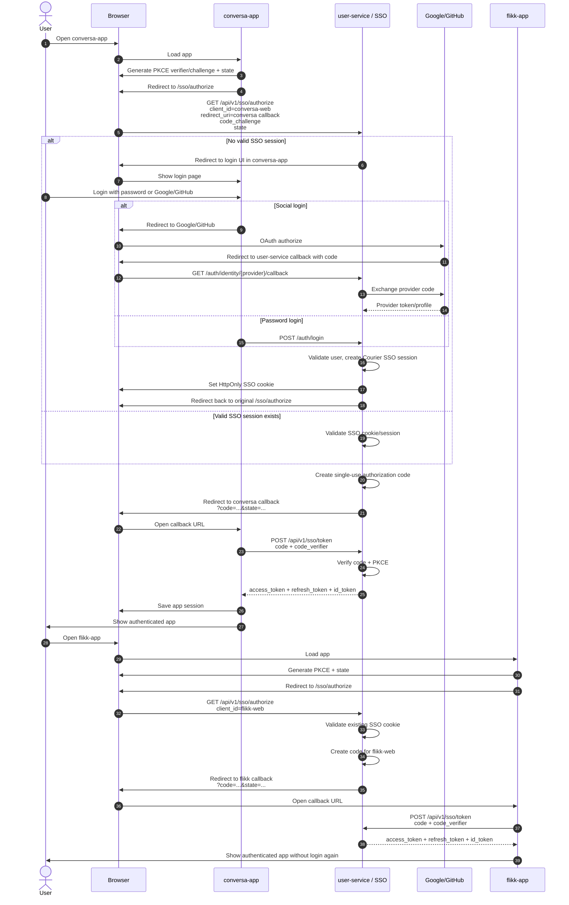
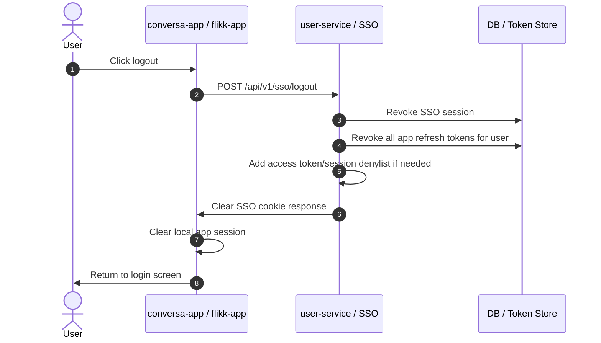
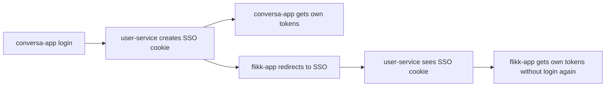

# Courier SSO Login Flow

This document captures the agreed phase-1 SSO design for Courier apps. The initial apps are `conversa-app` and `flikk-app`; future web and mobile clients should reuse the same pattern.

## Login And Cross-App SSO

## Global Logout

## Short Version

## Phase-1 Decisions

- Local testing uses `localhost:<port>` for now. Gateway/load-balancer domain setup can be revisited later.
- Phase 1 includes an OIDC `id_token`.
- Global logout revokes the SSO session and all app refresh tokens for the user.
- The login UI remains in `conversa-app` for phase 1.
- The implementation should be additive and preserve existing login/OAuth APIs during migration.
