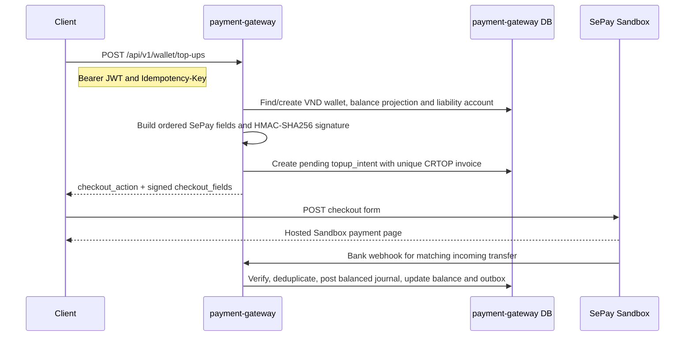

# SePay Sandbox Top-up Flow



## Current scope

The basic implementation creates the wallet, builds a server-signed SePay Sandbox
checkout form, then persists the pending intent. The client must POST the returned
fields to `checkout_action`; the secret key never leaves the service.

The SePay bank-webhook crediting path validates the HMAC signature and timestamp,
deduplicates the SePay transaction `id`, matches the payment code and exact
amount, then atomically persists provider evidence, posts a balanced double-entry
journal, updates the wallet projection and writes an outbox event. Redirect
success is never proof of payment.

## SePay Sandbox bank webhook contract (captured 2026-08-20)

Configure the provider to send `POST` JSON to:

```text
https://candied-corny-blatantly.ngrok-free.dev/api/v1/webhooks/sepay
```

Observed headers include `Content-Type: application/json`,
`X-SePay-Signature: sha256=<signature>` and
`X-SePay-Timestamp: <unix-timestamp>`. The handler preserves the raw body before
decoding it, validates the signature using the configured webhook secret, and
enforces a short timestamp tolerance to mitigate replay attacks.

```json
{
  "gateway": "Vietcombank",
  "transactionDate": "2026-08-20 15:17:57",
  "accountNumber": "0000000001",
  "subAccount": "SBSEPAY0OUMVNGTUSIX",
  "code": "COURVFG4IE",
  "content": "Thanh toan don hang COURVFG4IE",
  "transferType": "in",
  "description": "Thanh toan don hang COURVFG4IE",
  "transferAmount": 1000,
  "referenceCode": "SB7703EF77157F",
  "accumulated": 0,
  "id": 26671
}
```

For the top-up flow, accept only `transferType = "in"`, a known receiving
account, a payment code belonging to an unexpired top-up intent, and an exact
amount match. The `id` is the provider-event idempotency key. The endpoint must
respond within 30 seconds with `HTTP 200` (or `201`) and exactly:

```json
{"success": true}
```

SePay can retry failed deliveries up to seven times. During local development,
run `make ngrok`, then update the SePay webhook URL with the public tunnel URL
displayed by ngrok (or use a reserved ngrok domain).

Before testing, configure SePay's payment-code prefix as `CRTOP_`. The top-up
API returns that exact payment code as `invoice_number`; simulate an incoming
transfer with the same code and amount. Set
`PAYMENT_GATEWAY_SEPAY_WEBHOOK_SECRET` to the HMAC secret configured in SePay,
and list the test receiving account under `sepay.receivingAccountNumbers`.

## Local test request

```bash
curl -X POST http://localhost:5003/api/v1/wallet/top-ups \
  -H 'Content-Type: application/json' \
  -H 'Authorization: Bearer <courier-jwt>' \
  -H 'Idempotency-Key: 5e6c8b72-9c1c-4b32-a5a1-000000000001' \
  -d '{"amount_minor":100000,"method":"bank_transfer"}'
```

Set `PAYMENT_GATEWAY_SEPAY_MERCHANT_ID` and
`PAYMENT_GATEWAY_SEPAY_SECRET_KEY` in the environment before invoking the API.
Then run `make ngrok` and configure the SePay bank-webhook URL as
`/api/v1/webhooks/sepay` on the reserved ngrok domain.
