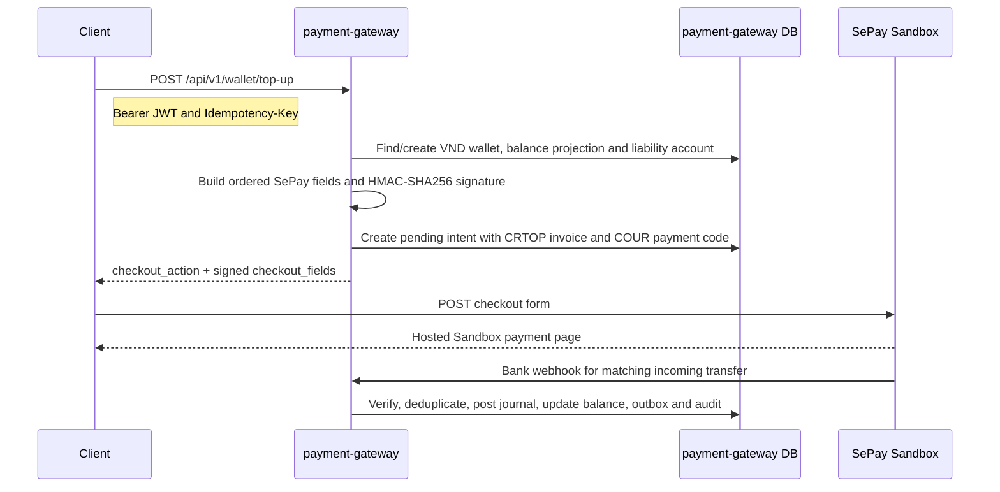

# SePay Sandbox Top-up Flow


```mermaid
sequenceDiagram
    participant Client
    participant PG as payment-gateway
    participant DB as payment-gateway DB
    participant SP as SePay Sandbox

    Client->>PG: POST /api/v1/wallet/top-up
    Note right of Client: Bearer JWT and Idempotency-Key
    PG->>DB: Find/create VND wallet, balance projection and liability account
    PG->>PG: Build ordered SePay fields and HMAC-SHA256 signature
    PG->>DB: Create pending intent with CRTOP invoice and COUR payment code
    PG-->>Client: checkout_action + signed checkout_fields
    Client->>SP: POST checkout form
    SP-->>Client: Hosted Sandbox payment page
    SP->>PG: Bank webhook for matching incoming transfer
    PG->>DB: Verify, deduplicate, post journal, update balance, outbox and audit
```

## Current scope

The create-top-up request requires `provider_name`. The basic implementation currently
registers `sepay`, creates the wallet, builds a server-signed SePay Sandbox
checkout form, then persists the pending intent. The client must POST the returned
fields to `checkout_action`; the secret key never leaves the service.

`provider_name: "vnpay"` is reserved in the API contract but currently returns
`provider_not_available` until the VNPAY adapter is implemented and registered.

The SePay bank-webhook crediting path validates the HMAC signature and timestamp,
deduplicates the SePay transaction `id`, matches the payment code and exact
amount, then atomically persists provider evidence, posts a balanced double-entry
journal, updates the wallet projection and writes an outbox event. Redirect
success is never proof of payment.

The authenticated user can retrieve the current projected wallet balance through
`GET /api/v1/wallet/balance`. The endpoint is read-only; if no VND wallet exists,
it returns a zero balance with `status: "not_created"`.

## Courier business invoice prefixes

`provider_invoice_number` is Courier's stable business identifier for a payment
request. It is distinct from `payment_code`, which is a provider-facing value
used to match an incoming transfer. New payment flows must use one of the
following prefixes:

| Prefix | Business flow |
| --- | --- |
| `TOPUP_<id>` | Wallet top-up |
| `SUBSC_<id>` | Subscription registration or renewal |
| `XFER_<id>` | Transfer between users |
| `PAY_<id>` | Service or order payment |
| `REFUND_<id>` | Refund |
| `REVERSAL_<id>` | Accounting reversal |

Prefixes are an internal Courier registry: do not reuse a prefix for a different
business meaning and do not change the prefix of an already-issued invoice. For
the current SePay Test mode flow, `payment_code` remains separate and follows
SePay's required `COUR[A-Za-z0-9]{6,8}` format.

## SePay Sandbox bank webhook contract (captured 2026-08-20)

Configure the provider to send `POST` JSON to:

```text
https://candied-corny-blatantly.ngrok-free.dev/api/v1/webhooks/sepay
```

Observed headers include `Content-Type: application/json`,
`X-SePay-Signature: sha256=<signature>` and
`X-SePay-Timestamp: <unix-timestamp>`. The handler preserves the raw body before
decoding it, validates the signature using the configured webhook secret, and
enforces a short timestamp tolerance to mitigate replay attacks.

```json
{
  "gateway": "Vietcombank",
  "transactionDate": "2026-08-20 15:17:57",
  "accountNumber": "0000000001",
  "subAccount": "SBSEPAY0OUMVNGTUSIX",
  "code": "COURVFG4IE",
  "content": "Thanh toan don hang COURVFG4IE",
  "transferType": "in",
  "description": "Thanh toan don hang COURVFG4IE",
  "transferAmount": 1000,
  "referenceCode": "SB7703EF77157F",
  "accumulated": 0,
  "id": 26671
}
```

For the top-up flow, accept only `transferType = "in"`, a known receiving
account, a payment code belonging to an unexpired top-up intent, and an exact
amount match. The `id` is the provider-event idempotency key. The endpoint must
respond within 30 seconds with `HTTP 200` (or `201`) and exactly:

```json
{"success": true}
```

SePay can retry failed deliveries up to seven times. During local development,
run `make ngrok`, then update the SePay webhook URL with the public tunnel URL
displayed by ngrok (or use a reserved ngrok domain).

Before testing, use the `payment_code` returned by the top-up API. Courier
generates it in SePay Test mode's accepted format: `COUR` followed by eight
uppercase alphanumeric characters, for example `COUR5WTAA89W`. `invoice_number`
remains a separate Courier checkout invoice in the form `CRTOP_<id>`. Simulate
an incoming transfer with the returned `payment_code` and the same amount. Set
`PAYMENT_GATEWAY_SEPAY_WEBHOOK_SECRET` to the HMAC secret configured in SePay,
and list the test receiving account under `sepay.receivingAccountNumbers`.

## Local test request

```bash
curl -X POST http://localhost:5003/api/v1/wallet/top-up \
  -H 'Content-Type: application/json' \
  -H 'Authorization: Bearer <courier-jwt>' \
  -H 'Idempotency-Key: 5e6c8b72-9c1c-4b32-a5a1-000000000001' \
  -d '{"amount_minor":100000,"method":"bank_transfer","provider_name":"sepay"}'
```

Set `PAYMENT_GATEWAY_SEPAY_MERCHANT_ID` and
`PAYMENT_GATEWAY_SEPAY_SECRET_KEY` in the environment before invoking the API.
Then run `make ngrok` and configure the SePay bank-webhook URL as
`/api/v1/webhooks/sepay` on the reserved ngrok domain.

## Ignored webhook events

Courier acknowledges ignored events with HTTP 200 so SePay does not retry a
transaction that cannot become a wallet credit. Inspect
`"payment-gateway".provider_events.error_code` to identify the reason.

| Error code | Meaning |
| --- | --- |
| `topup_intent_not_found` | SePay `code` does not match any `payment_code`. |
| `amount_mismatch` | SePay transfer amount differs from `amount_minor`. |
| `topup_not_payable` | Intent is no longer `pending` or is past `expires_at`. |
| `topup_already_succeeded` | The intent was already credited. |
| `transaction_not_eligible` | Transaction is not an incoming transfer or does not include a code. |
